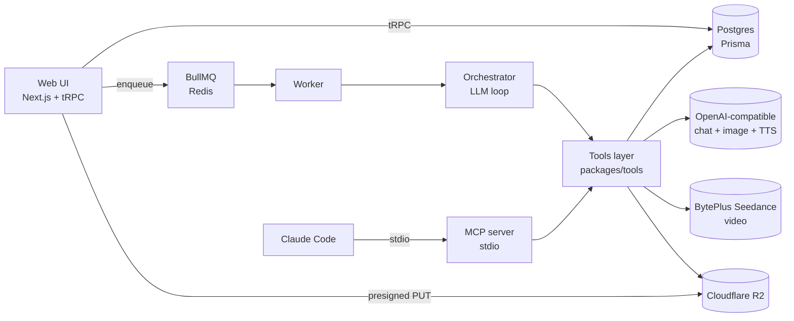

# Shri — Automated Marketing Content Studio

> Drop in a product. Get back a director's brief, a content plan, and a table of carousels and 6-12s reels. Pick the ones you want. The system generates them. You download and post.

---

## 1. What this is

A hands-off marketing pipeline for your own products. The whole studio runs on three things:

- An **OpenAI-compatible chat model** (configurable `baseURL` — point it at OpenAI, Claude via OpenRouter, or any compatible gateway) does the planning, copywriting, and creative direction.
- **Cloudflare R2** holds every asset (uploads, generated images, generated videos).
- **A web app on Railway** is the only thing you interact with — upload a product, click "Generate brief," select rows in a table, click "Generate selected," download finished files.

Every other moving part — BytePlus Seedance for video, OpenAI image gen + TTS, Satori for slide rendering, opencv for text placement, ffmpeg for audio mux, BullMQ for the job queue — is hidden behind a single shared tool layer that both the autonomous worker and an MCP server consume.

---

## 2. The 60-second mental model

```
   ┌────────────────────────────────────────────────────────────────────┐
   │                                                                    │
   │   1. NEW PROJECT                                                   │
   │      You upload icon, screenshots, screen-recording.               │
   │      You write a short description + what to highlight.            │
   │      You drop in a product website URL (optional).                 │
   │      → Site is crawled, product profile extracted.                 │
   │      → Per-project prompts (incl. theme/story) are LLM-generated.  │
   │                                                                    │
   │                          │                                         │
   │                          ▼                                         │
   │                                                                    │
   │   1b. (OPTIONAL) CHARACTERS + THEME                                │
   │       Design a mascot via form or chat. AI generates base,         │
   │       6 view poses, and a merged character sheet (JPEG).           │
   │       Tune the theme/story file for shared visual world.           │
   │                                                                    │
   │                          │                                         │
   │                          ▼                                         │
   │                                                                    │
   │   2. GENERATE BRIEF                                                │
   │      Worker spins up an LLM loop using the per-project .md         │
   │      prompts. It returns a director's brief: hooks, scenes,        │
   │      slide ideas, audio choices, posting cadence, est. cost.       │
   │                                                                    │
   │                          │                                         │
   │                          ▼                                         │
   │                                                                    │
   │   3. SELECTION TABLE                                               │
   │      Every proposed item is a row: type, platform, ratio, hook,    │
   │      cost. Checkbox per row. Pick what you want.                   │
   │      Click any row to read + edit the elaborate concept:           │
   │      the exact Seedance prompt, camera angles, voiceover text,     │
   │      slide spec. Edit before you spend.                            │
   │                                                                    │
   │                          │                                         │
   │                          ▼                                         │
   │                                                                    │
   │   4. GENERATE SELECTED                                             │
   │      Worker fans out: image gen, JSX → Satori → PNG, opencv        │
   │      text placement, Seedance task submission, TTS, ffmpeg mux.    │
   │      Everything lands in R2.                                       │
   │                                                                    │
   │                          │                                         │
   │                          ▼                                         │
   │                                                                    │
   │   5. DOWNLOAD                                                      │
   │      Item detail page: preview, copy caption, download asset.      │
   │      You post manually.                                            │
   │                                                                    │
   └────────────────────────────────────────────────────────────────────┘
```

The two clicks that matter: "Generate brief" (cheap, text only) and "Generate selected" (the part that spends money).

---

## 3. System diagram



Two consumers, one tool layer. That's the whole architectural idea.

---

## 4. The two consumers of the tool layer

`packages/tools/` is the single source of truth for what the studio can do. Every capability — generate an image, render a JSX slide, place text on a photo, submit a Seedance job, mux audio, save an output — is one function in this package.

Two things consume those functions:

| Consumer | What it is | When it runs |
|---|---|---|
| **`apps/worker`** | A BullMQ worker process. Drives an LLM via OpenAI function-calling. The LLM picks tools to call; the worker executes them. | Whenever you click "Generate brief" or "Generate selected" in the web app. |
| **`apps/mcp`** | An MCP stdio server. Exposes the same tools as MCP tools so Claude Code can call them interactively. | When you want to drive the studio yourself from Claude Code (debugging, one-off content, exploration). |

A `toolDescriptors` table in [packages/tools/index.ts](packages/tools/index.ts) maps each tool to both an OpenAI function schema and an MCP tool schema. Adding a new tool means writing one function — both consumers pick it up for free.

See [docs/03-tools.md](docs/03-tools.md) for the full tool surface and [docs/06-mcp-server.md](docs/06-mcp-server.md) for the MCP wiring.

---

## 5. Tech stack at a glance

| Layer | Choice | Why |
|---|---|---|
| Web app | Next.js (App Router) + tRPC + Prisma | Single deploy, end-to-end types, fast iteration. |
| DB | Postgres (Railway addon) | Boring and bulletproof. |
| Queue | BullMQ + Redis (Railway addon) | Built-in retry, delay, and re-enqueue — critical for non-blocking Seedance polling. |
| Storage | Cloudflare R2 | S3-compatible, no egress fees, presigned URLs Seedance can hit. |
| AI chat / image / TTS | `openai` SDK with custom `baseURL` | One env-driven gateway, swap providers without code changes. |
| Video | BytePlus ModelArk Seedance REST | Task-based; we submit, poll, download to R2. |
| JSX → PNG | `satori` + `@resvg/resvg-js` | Vercel-OG pattern. Fast, deterministic, no headless browser. |
| Text placement | `@u4/opencv4nodejs` | Saliency + edge-density grid to find low-detail regions. |
| Audio mux | `fluent-ffmpeg` + `ffmpeg-static` | Combines Seedance silent video + OpenAI TTS into final MP4. |
| MCP | `@modelcontextprotocol/sdk` (TS) | Standard MCP stdio server. |
| Auth | Basic auth via Next middleware | Single user; no need for OAuth or sessions. |

Full env contract in [.env.example](.env.example).

---

## 6. Repo map

```
shri/
├── Docs.md                  ← you are here
├── docs/                    ← deep-dive design files (this folder)
├── apps/
│   ├── web/                 ← Next.js UI + tRPC API + R2 upload presigners
│   ├── worker/              ← BullMQ worker that drives the orchestrator
│   └── mcp/                 ← MCP stdio server (same tools, different consumer)
├── packages/
│   ├── db/                  ← Prisma schema + client
│   ├── storage/             ← R2 client (presign, put, get, copy)
│   ├── seedance/            ← BytePlus REST client (submit + poll + download)
│   ├── tools/               ← THE shared tool surface
│   ├── orchestrator/        ← LLM loop, prompt loading, job runner
│   └── prompts-fs/          ← Reads/writes per-project prompt .md files
├── prompts/                 ← Default prompt templates (six files)
├── prompts-projects/        ← Per-project prompt overrides (Railway volume mount)
└── scripts/
    └── manual-seedance-smoke.ts   ← Live Seedance test (you run this)
```

---

## 7. Where to read next

| If you want to understand... | Read |
|---|---|
| How a single content job flows end-to-end | [docs/01-data-flow.md](docs/01-data-flow.md) |
| How the LLM loop drives tool calls | [docs/02-orchestrator.md](docs/02-orchestrator.md) |
| The tool surface (what the LLM can do) | [docs/03-tools.md](docs/03-tools.md) |
| The Seedance video pipeline | [docs/04-seedance.md](docs/04-seedance.md) |
| Canva-like slides vs text-on-image carousels | [docs/05-images-carousels.md](docs/05-images-carousels.md) |
| The MCP server | [docs/06-mcp-server.md](docs/06-mcp-server.md) |
| The per-project `.md` prompt system | [docs/07-prompts.md](docs/07-prompts.md) |
| Data model + R2 key layout | [docs/08-storage-and-data.md](docs/08-storage-and-data.md) |
| Every web route and the selection-table UI | [docs/09-web-app.md](docs/09-web-app.md) |
| How costs are estimated and shown | [docs/10-cost-and-pricing.md](docs/10-cost-and-pricing.md) |
| Railway deployment layout | [docs/11-deployment.md](docs/11-deployment.md) |
| Adding new tools, content types, or providers | [docs/12-extending.md](docs/12-extending.md) |
| Website crawling + LLM-generated per-project prompts | [docs/13-crawling-and-prompt-gen.md](docs/13-crawling-and-prompt-gen.md) |
| Characters: consistent mascots/avatars across all ads | [docs/14-characters.md](docs/14-characters.md) |
| Theme & story: shared visual world per project | [docs/15-theme-story.md](docs/15-theme-story.md) |
| Editable elaborate concepts (review/edit Seedance scripts before generation) | [docs/16-editable-concepts.md](docs/16-editable-concepts.md) |
| Director's perspective: environment + scene types + (optional) multi-scene reels | [docs/17-director-scenes.md](docs/17-director-scenes.md) |
| `aiClient` — the single object every AI call flows through (swap providers per-method) | [docs/18-ai-client.md](docs/18-ai-client.md) |

---

## 8. Running it locally

```bash
pnpm install
cp .env.example .env       # then fill in OpenAI, R2, ARK keys
docker compose up -d       # Postgres + Redis
pnpm db:migrate            # Prisma migrate
pnpm dev                   # web + worker concurrently
```

`apps/mcp` runs separately (it's an stdio server, not a long-lived web process):

```bash
pnpm --filter @shri/mcp start
# then in Claude Code:
claude mcp add shri 'pnpm --filter @shri/mcp start'
```

---

## 9. Execution tracking

- [CLAUDE.md](CLAUDE.md) — project memory auto-loaded into every Claude Code session in this repo (conventions, commands, env, do-not-break rules)
- [PHASE.md](PHASE.md) — live status of the three-phase subagent scaffold (allowlists, PM gates, handoff reports)

---

## 10. What I verify vs what you verify

| Path | Who tests it |
|---|---|
| Project create + asset upload to R2 | Me — automated |
| `runBriefJob` against real OpenAI gateway | Me — automated |
| Image gen, JSX carousel render, opencv text placement | Me — automated against real APIs |
| OpenAI TTS + ffmpeg mux against fixture MP4 | Me — automated |
| MCP server smoke (list tools, invoke from Claude Code) | Me — automated |
| BullMQ resilience (kill Redis mid-job) | Me — automated |
| **BytePlus Seedance submit + poll + download** | **You — run `scripts/manual-seedance-smoke.ts`** |
| **End-to-end reel generation in all 3 audio modes** | **You — click through the web UI** |

Seedance specifically has no mocks anywhere in the codebase. You own that smoke because you own the API key and the credits.
