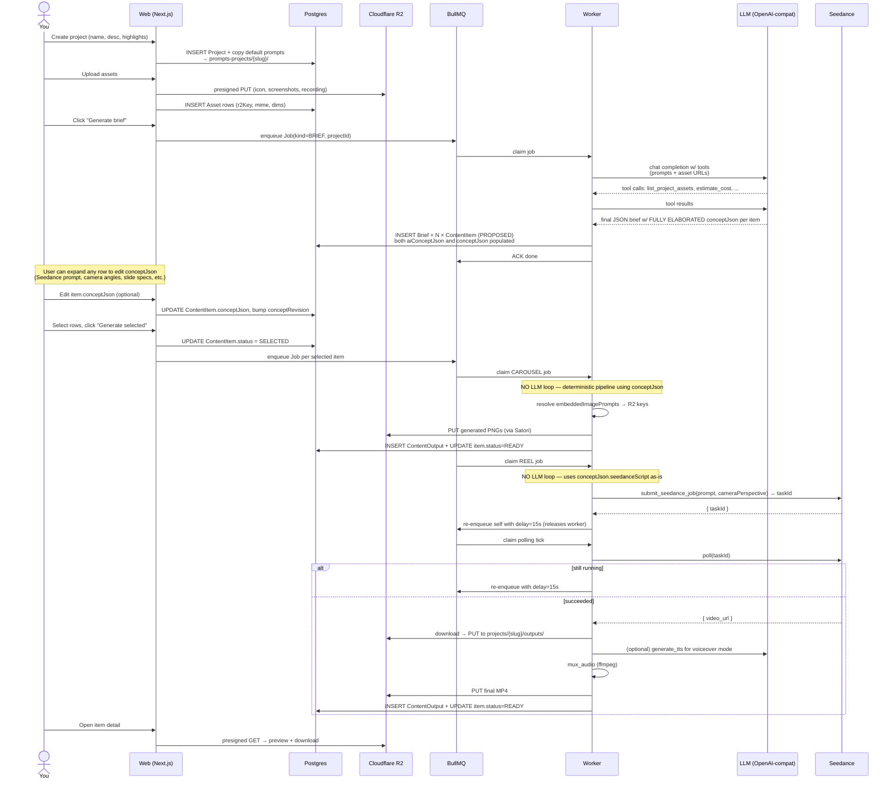

# 01 — Data Flow

**Purpose:** Show the end-to-end lifecycle of a content job, from product creation to a downloadable asset, including every persisted state transition along the way.

---

## The full lifecycle



---

## State machines

### `ContentItem.status`

```
        +----------+   user selects   +----------+
        | PROPOSED |─────────────────►| SELECTED |
        +----------+                  +----------+
                                            │
                                            │ worker picks up
                                            ▼
                                      +------------+
                                      | GENERATING |
                                      +------------+
                                            │
                              success ┌─────┴─────┐ failure
                                      ▼           ▼
                                +--------+   +--------+
                                | READY  |   | FAILED |
                                +--------+   +--------+
```

`PROPOSED` → never enqueued, just suggested by the brief. Cheap to discard.
`SELECTED` → in the queue or about to be.
`GENERATING` → a worker has it claimed; logs accumulating in `Job.logs`.
`READY` → at least one `ContentOutput` exists for this item.
`FAILED` → `Job.error` populated; surfaces in `/jobs`.

### `Job.status`

```
QUEUED → RUNNING → DONE
                  ↘ FAILED (terminal, with error)
```

A single ContentItem can spawn multiple Jobs over its lifetime (initial generation, manual re-run, polling ticks for Seedance). Each Seedance polling tick is its own delayed re-enqueue of the same job spec, not a new Job row — `Job.logs` accumulates across ticks.

---

## Why this shape

**Brief generation is decoupled from item generation.** You always get the table first. Briefs are cheap; finished media is expensive. The selection step is where you spend money.

**Seedance polling does not block a worker.** A naive implementation would call `submit` then `poll` in a tight loop for 90 seconds while holding a BullMQ worker. Instead, after `submit` we re-enqueue the same job with a 15s delay. The worker is freed immediately and can run other jobs. When the delay fires, the job comes back, polls once, and either finishes or re-enqueues again. This means a single worker can handle ~50 concurrent Seedance jobs.

**All artifacts live in R2 keyed by project slug.** Easy to delete a project's blob storage; easy to audit; presigned URLs let Seedance fetch your inputs and let you serve previews without proxying through Next.js.

---

## See also
- [02-orchestrator.md](02-orchestrator.md) — the LLM loop that powers brief + item jobs
- [04-seedance.md](04-seedance.md) — Seedance task lifecycle in detail
- [08-storage-and-data.md](08-storage-and-data.md) — the Prisma schema and R2 key layout
