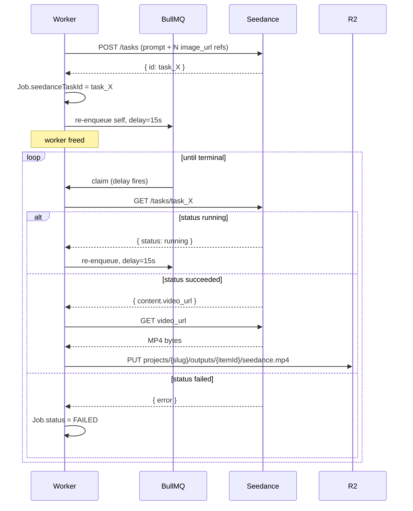

# 04 — Seedance Video Pipeline

**Purpose:** Document the BytePlus ModelArk Seedance integration — the REST contract, the polling pattern, the three audio modes, and the ffmpeg mux step.

---

## The BytePlus contract

Task-based async API. You submit, you get an ID, you poll, eventually you get a video URL.

### Submit

```http
POST /api/v3/contents/generations/tasks
Host: ark.ap-southeast.bytepluses.com
Authorization: Bearer $ARK_API_KEY
Content-Type: application/json

{
  "model": "dreamina-seedance-2-0-260128",
  "content": [
    { "type": "text", "text": "<prompt — uses @Image1, @Image2, … to refer to refs>" },
    { "type": "image_url", "image_url": { "url": "<presigned R2 URL — becomes @Image1>" } },
    { "type": "image_url", "image_url": { "url": "<presigned R2 URL — becomes @Image2>" } }
  ],
  "generate_audio": true,
  "ratio": "9:16"
}
```

The `content` array accepts **multiple `image_url` entries** (Seedance 2.0 omni-reference). Their order is significant: the first `image_url` is `@Image1`, the second is `@Image2`, etc. The text prompt must explicitly refer to each reference by tag — see [the @-reference convention](#the-image-reference-convention) below.

Capacity per request (per the Seedance 2.0 docs): **up to 9 `image_url`, 3 video, 3 audio refs** — 12 total.

### The @-image reference convention

Seedance 2.0 reads references positionally and binds them to text tokens of the form `@Image{N}` (capitalized, 1-indexed, no spaces). The guides are explicit: *"unnamed references may be ignored or misinterpreted"* — so every reference must be named in the prompt body, and naming it with an `as <role>` clause is strongly recommended.

Pattern: `@Image{N} as <role>`, where `<role>` is a short natural-language phrase such as `character`, `environment`, `background`, `subject`, `the first frame`, `the opening frame`. Free-form — Seedance reads it as natural language, not a fixed enum.

A two-reference example that mirrors the canonical Seedance 2.0 prompt:

```
@Image1 as the character, @Image2 as the environment.
medium shot, eye level. slow dolly-in camera, normal lens, shallow dof.

The character walks toward the camera through the environment as the
late-afternoon light catches their face. 0-3s establish, 3-8s the
character turns and smiles.
```

References must be **presigned R2 URLs**. Seedance fetches them server-side (no auth header from its side). Same R2 asset can be reused across many submissions — character sheets, product shots, and theme reference frames live in R2 as shareable assets and get freshly presigned per job. We do not pass external URLs (LLM-suggested stock images, etc.) directly to Seedance — they go through R2 first via `generate_image`.

### The camera-perspective convention

Seedance produces dramatically better video when the prompt describes the *shot*, not just the *scene*. Flat prompts ("a woman in a kitchen") yield flat, generic clips. Cinematic prompts ("medium shot, eye-level, slow dolly-in toward a woman at a wooden desk, shallow DoF, late afternoon light") yield the kind of thing you want to post.

Seedance 2.0's own guide formalises this as a **6D formula**: Subject → Action → Scene → Camera → Lighting → Time/rhythm. Camera and Time/rhythm are foundational; the others shape mood. We bake **Camera** into the schema (because it's the dimension models most often skip) and rely on the orchestrator instructions to keep the rest present in the freeform prompt body.

`submit_seedance_job` takes a **structured `cameraPerspective` field** in addition to the free-form prompt. The tool composes those choices into the final BytePlus prompt automatically — the AI cannot skip camera direction even if it wants to:

```ts
input: {
  projectSlug: string;
  itemId: string;
  prompt: string;                    // scene description — MUST reference each @ImageN by tag
  cameraPerspective: {               // REQUIRED, not optional
    framing:  "extreme_wide" | "wide" | "medium" | "close_up" | "extreme_close_up";
    angle:    "low" | "eye_level" | "high" | "birds_eye" | "dutch";
    movement: "static" | "pan" | "tilt" | "dolly_in" | "dolly_out" | "tracking" | "handheld" | "crane";
    lens:     "wide_angle" | "normal" | "telephoto" | "macro";
    focus:    "shallow_dof" | "deep_dof" | "rack_focus";
  };
  references?: Array<{               // up to 9; position determines @ImageN index (1-based)
    r2Key: string;                   // shared R2 asset; handler presigns at submit-time
    role: string;                    // free-form: "character", "environment",
                                     // "the first frame", "background", "subject", …
  }>;
  generateAudio: boolean;
  ratio: "9:16" | "1:1" | "16:9" | "adaptive";
};
```

Why `r2Key` and not a presigned URL on the input? Two reasons: (1) presigned URLs expire — the orchestrator may hold a planned job for minutes before submitting, so we presign at submit-time, not at plan-time; (2) the same R2 asset is shareable across many jobs (one character sheet → dozens of reels) and storing the bare key keeps the plan small and stable.

The handler builds the final prompt like this:

```ts
function composePrompt(p: Input): string {
  const cp = p.cameraPerspective;
  const cameraSentence =
    `${cp.framing.replace(/_/g, " ")} shot, ${cp.angle.replace(/_/g, " ")}. ` +
    `${cp.movement.replace(/_/g, " ")} camera, ${cp.lens.replace(/_/g, " ")} lens, ${cp.focus.replace(/_/g, " ")}.`;

  const refsSentence = (p.references ?? [])
    .map((r, i) => `@Image${i + 1} as ${r.role}`)
    .join(", ");

  return [refsSentence && `${refsSentence}.`, cameraSentence, p.prompt]
    .filter(Boolean)
    .join("\n\n");
}
```

Two validation rules the handler enforces before submission:

1. **Every passed reference must be mentioned in `prompt`** by its `@ImageN` tag. The handler scans the freeform `prompt` for each tag and rejects the call with a clear error if any is missing. This is the cheap guardrail against the "unnamed references may be ignored or misinterpreted" failure mode.
2. **No more than 9 references.** Schema-level cap, matching the Seedance 2.0 limit.

So a model that calls:

```json
{
  "cameraPerspective": { "framing": "medium", "angle": "eye_level", "movement": "dolly_in", "lens": "normal", "focus": "shallow_dof" },
  "references": [
    { "r2Key": "projects/my-app/characters/abc/sheet.jpg", "role": "the character" },
    { "r2Key": "projects/my-app/uploads/desk-photo.jpg",   "role": "the environment" }
  ],
  "prompt": "@Image1 walks toward camera through @Image2 in late afternoon light. She looks up and smiles. 0-3s establish the room, 3-8s she reaches the desk."
}
```

…produces this BytePlus request body:

```json
{
  "model": "dreamina-seedance-2-0-260128",
  "content": [
    { "type": "text", "text": "@Image1 as the character, @Image2 as the environment.\n\nmedium shot, eye level. dolly in camera, normal lens, shallow dof.\n\n@Image1 walks toward camera through @Image2 in late afternoon light. She looks up and smiles. 0-3s establish the room, 3-8s she reaches the desk." },
    { "type": "image_url", "image_url": { "url": "<presigned URL for sheet.jpg>" } },
    { "type": "image_url", "image_url": { "url": "<presigned URL for desk-photo.jpg>" } }
  ],
  "generate_audio": true,
  "ratio": "9:16"
}
```

`cameraPerspective` being a required schema field means camera direction always lands in the prompt. The `@ImageN`-mention check means references always have a textual binding. The MCP server's `instructions` block (see [06-mcp-server.md](06-mcp-server.md)) tells the model the rest — the 6D formula, prompt length, no negative prompts.

The `references` array is optional. Omit it for text-to-video; pass one or more entries for reference-driven generation (image-to-video opening frame, character lock, environment lock, or any combination).

**Negative prompts are not supported by Seedance** ([source](https://www.seedanceai.cc/guides/seedance-2-0-prompts)). The schema deliberately has no `negativePrompt` field — express constraints positively in the prompt instead ("warm tones, soft daylight" rather than "no harsh shadows").

Response (immediate):

```json
{ "id": "task_..." }
```

### Poll

```http
GET /api/v3/contents/generations/tasks/{taskId}
Authorization: Bearer $ARK_API_KEY
```

Response while running:

```json
{ "id": "task_...", "status": "queued" }
{ "id": "task_...", "status": "running" }
```

Response on success:

```json
{
  "id": "task_...",
  "status": "succeeded",
  "content": { "video_url": "https://.../task_....mp4" }
}
```

Response on failure:

```json
{ "id": "task_...", "status": "failed", "error": { "code": "...", "message": "..." } }
```

Typical end-to-end completion: **60-90 seconds** for a 6-12s clip.

---

## The lifecycle in our system



The download-to-R2 step is critical. Seedance video URLs are signed and expire — we mirror to R2 so you own the asset permanently.

---

## Reference inputs

Every entry in `references[]` must be:

- **An R2 key for an asset already in our bucket.** External URLs (LLM-suggested stock images, etc.) are rejected at the schema level — bring them into R2 via `generate_image` or an explicit upload first.
- **JPEG or PNG**, ≤ 30 MB (per the Seedance 2.0 multimodal guide).
- **Aspect ratio matching `ratio`** ideally for the "first frame" role, or `ratio: "adaptive"` to let Seedance decide.

The handler presigns each `r2Key` at submit-time with **a 1-hour expiry** — long enough that Seedance can fetch even if its queue is backlogged, short enough that the URL doesn't outlive the job. Same R2 asset is freely reused across many jobs (a character sheet anchors every reel that features the character).

**Pass only the references the shot uses.** Don't dump every character, upload, and theme reference the project has into every job — each extra ref dilutes Seedance's attention, costs against the 9-image cap, and slows server-side fetch. The orchestrator (and the LLM driving it) is responsible for picking the load-bearing set per shot: a close-up of one character needs that character's sheet, nothing else; a wide environmental shot may need character + environment; a prompt-only scene needs no references at all. The `@ImageN`-mention check is a floor against passing *unused* refs, not a license to pass *extra* ones.

For the special case of "use this image as the opening frame of the video," set `role: "the first frame"` on that reference and refer to it in the prompt as such. Seedance will animate from that still.

---

## The three audio modes

The LLM picks the mode per item based on the director's brief. Stored in `ContentItem.conceptJson.audioMode`.

### Mode A — `seedance`

```
submit_seedance_job(prompt, references?, generate_audio: true)
   → poll → download → save_content_output
```

Seedance generates ambient SFX + foley to match the scene. No mux step. Cheapest path. Good for vibe shots, lifestyle clips, ambient product reveals.

### Mode B — `silent`

```
submit_seedance_job(prompt, references?, generate_audio: false)
   → poll → download → save_content_output (meta.needs_music = true)
```

Silent video. Flagged in `ContentOutput.meta` so you know to add music in your editor after download. We don't auto-add music — licensing is your call.

### Mode C — `voiceover`

```
submit_seedance_job(prompt, references?, generate_audio: false)  ── parallel ──┐
generate_tts(text: hook, voice: env.OPENAI_TTS_VOICE)            ─────────────┤
   → poll → download silent MP4                                                │
   → wait for TTS MP3                                                          │
   → mux_audio(video, audio)  ◄──────────────────────────────────────────────┘
   → save_content_output
```

ffmpeg mux command:

```bash
ffmpeg -i video.mp4 -i voice.mp3 \
  -c:v copy \
  -c:a aac -b:a 128k \
  -shortest \
  -y out.mp4
```

`-c:v copy` keeps the video stream untouched (no re-encode). `-shortest` clips the audio to the video length so the voiceover doesn't extend past the visual.

---

## Error handling

| Failure | What we do |
|---|---|
| Reference passed but `@ImageN` not in prompt body | Reject at the tool boundary before submission. Error message names the missing tag and reminds the LLM to mention each reference. |
| `references.length > 9` | Zod-level reject. Seedance 2.0 caps images at 9. |
| Submit 4xx (bad params) | Surface the error to the LLM — let it retry with corrected params. Job stays RUNNING. |
| Submit 5xx | BullMQ-level retry (3 attempts, exponential backoff). |
| Poll returns `failed` | `Job.status = FAILED`, `Job.error = <message>`. Item stays `GENERATING` until manual retry from UI. |
| Poll times out (no terminal status in N ticks) | After 20 polling ticks (~5 min), mark Job FAILED. |
| Download from Seedance URL fails | Retry the download up to 3 times, then mark FAILED. |
| ffmpeg mux fails | Mark FAILED with stderr in `Job.error`. |

---

## What's not mocked

Every part of this pipeline talks to real systems in tests:

- ffmpeg mux is tested against a small fixture MP4 + MP3 included in the repo.
- TTS is tested against the real OpenAI API when `OPENAI_API_KEY` is set.
- **Seedance submit + poll has zero automated tests.** A `scripts/manual-seedance-smoke.ts` script lets you verify end-to-end against the real BytePlus API on demand. You own this smoke because you own the key.

If the BytePlus contract drifts (field renames, status enum changes), you'll find out when you run that script. The code will be fixed against the real error response, not against a guessed mock.

---

## See also
- [02-orchestrator.md](02-orchestrator.md) — the delayed re-enqueue pattern that makes polling non-blocking
- [03-tools.md](03-tools.md) — `submit_seedance_job` and `poll_seedance_job` descriptor schemas
- [08-storage-and-data.md](08-storage-and-data.md) — `Job.seedanceTaskId` field + R2 output key layout
