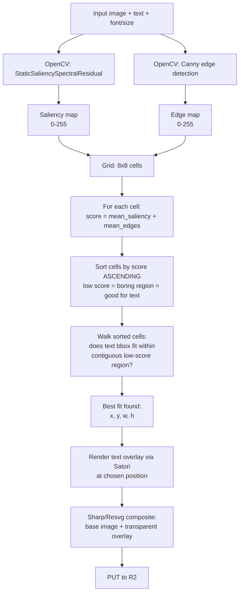

# 05 — Images & Carousels

**Purpose:** Explain the two carousel sub-types — Canva-like (constrained JSX → PNG) and text-on-image (opencv-driven placement) — and why they're separate paths.

---

## Two carousel types

A `ContentItem.type` is one of:

- `CAROUSEL_CANVA` — fully composed slides built from a JSON spec. The LLM controls every layer.
- `CAROUSEL_TEXT_OVERLAY` — a base image (your screenshot, or an OpenAI-generated photo) with text laid on top of low-detail regions.

They share nothing at runtime except the final "upload PNG to R2" step. Different problems, different tools.

---

## Canva-like — `render_jsx_carousel`

### The constrained spec

The LLM cannot return arbitrary JSX (security + determinism). It returns a constrained JSON spec that we validate with Zod, then build into a React element tree internally:

```ts
const SlideSpec = z.object({
  width: z.number(),                       // e.g. 1080
  height: z.number(),                      // e.g. 1350 for IG 4:5
  background: z.union([
    z.object({ kind: z.literal("color"), value: z.string() }),
    z.object({ kind: z.literal("gradient"), from: z.string(), to: z.string(), angle: z.number() }),
    z.object({ kind: z.literal("image"), r2Key: z.string() }),
  ]),
  layers: z.array(z.union([
    z.object({
      kind: z.literal("text"),
      x: z.number(), y: z.number(), w: z.number(),
      text: z.string(),
      font: z.enum(["Inter","Inter-Bold","DM-Serif","JetBrains-Mono"]),
      size: z.number(),
      color: z.string(),
      align: z.enum(["left","center","right"]).default("left"),
      lineHeight: z.number().default(1.1),
    }),
    z.object({
      kind: z.literal("image"),
      x: z.number(), y: z.number(), w: z.number(), h: z.number(),
      r2Key: z.string(),
      borderRadius: z.number().optional(),
    }),
    z.object({
      kind: z.literal("rect"),
      x: z.number(), y: z.number(), w: z.number(), h: z.number(),
      fill: z.string(),
      borderRadius: z.number().optional(),
    }),
  ])),
});

const CarouselSpec = z.object({
  slides: z.array(SlideSpec).min(1).max(12),
});
```

### The render pipeline

```
LLM emits CarouselSpec JSON
        │
        ▼
Zod validates
        │
        ▼
For each slide:
   build React element tree in-memory
        │
        ▼
   satori(reactTree, { width, height, fonts }) → SVG string
        │
        ▼
   new Resvg(svg).render().asPng() → PNG buffer
        │
        ▼
   storage.putObject(`projects/{slug}/outputs/{itemId}/slide-{i}.png`, png)
        │
        ▼
ContentOutput with all slide r2Keys
```

### Font loading

Satori requires explicit fonts. We ship four bundled in `packages/tools/fonts/`:

- Inter Regular + Bold (UI / body text)
- DM Serif Display (headlines)
- JetBrains Mono (code / numbers)

Read into Buffers at startup, passed into every Satori call. Adding a font means adding a TTF and an enum entry — see [12-extending.md](12-extending.md).

### Why not headless Chromium?

| | Satori | Playwright/Chromium |
|---|---|---|
| Speed | ~50-100ms/slide | ~500ms-2s/slide |
| Deploy size | KBs | ~150MB |
| CSS support | Subset (most flexbox, no JS) | Full |
| Determinism | High | Lower (timing variances) |

The constrained spec doesn't need JS or animations — Satori is the right tool.

---

## Text-on-image — `place_text_on_image`

The hard problem: given a busy real-world image (a screenshot of your app, an OpenAI-generated lifestyle photo), where do you put the headline text so it's legible and doesn't cover anything important?

### The algorithm



### Why both saliency AND edges?

- **Saliency** = "what would a human eye naturally look at." Faces, focal subjects.
- **Edges** = "where is there visual detail." Even a low-saliency edge area (a textured background) is hard to read text over.

Combined score finds genuine empty regions, not just "areas the algorithm thinks are boring."

### The grid

8×8 = 64 cells. Each cell gets a single score (mean of saliency + edges within the cell). We greedily look for contiguous rectangles of low-score cells big enough to hold the text bounding box at the requested font size.

Text bbox estimation is rough: `width ≈ chars × size × 0.55` for the chosen font, `height ≈ lines × size × lineHeight`. Good enough; the LLM can re-prompt with a smaller font if the returned region is unsatisfying.

### Output

```ts
type PlaceResult = {
  r2Key: string;                                    // final composite PNG
  region: { x: number, y: number, w: number, h: number };
  scoreAtRegion: number;                            // for debug / re-prompt
  fallback: boolean;                                // true if we had to use a low-confidence region
};
```

The `region` is returned so the LLM can decide to retry with different text length or font size if `scoreAtRegion` is high (region wasn't great).

---

## Why two separate paths?

We considered a unified "all carousels go through Satori" but rejected it:

- Text-over-real-image needs the actual photo composited at full resolution. Satori would have to load the photo as a background, which means the photo has to be small enough to fit in a Satori-renderable SVG. Loses quality.
- Canva-like slides have rich layout (multiple text layers, shapes, gradients) that opencv placement doesn't care about.

The two tools have different inputs (LLM-authored spec vs LLM-chosen text + base image) and different outputs (multi-slide carousel vs single composite). Keeping them separate keeps each tool simple.

---

## See also
- [03-tools.md](03-tools.md) — `render_jsx_carousel` and `place_text_on_image` descriptor schemas
- [02-orchestrator.md](02-orchestrator.md) — how the LLM chooses between the two carousel types
- [07-prompts.md](07-prompts.md) — `carousel-plan.md` and `text-overlay-copy.md` shape the LLM's choices
