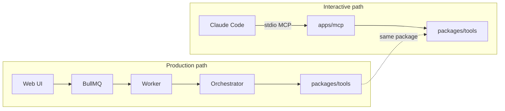

# 06 — MCP Server

**Purpose:** Explain the standalone MCP stdio server that exposes the same tool layer as the worker, so Claude Code can drive the studio interactively.

---

## Why it exists

The web app is for hands-off production: you upload a product, click two buttons, get content.

The MCP server is for when you want to be in the loop: experimenting with prompts, generating a one-off carousel, debugging a failing job, scripting bulk operations. You open Claude Code, the MCP server is registered, and Claude has direct access to every tool the worker uses.

Both consume the same `packages/tools/` — there's no separate "interactive vs production" tool surface to maintain.



---

## The wiring

`apps/mcp/src/index.ts` is a short stdio server:

```ts
// shape, not literal
import { Server } from "@modelcontextprotocol/sdk/server/index.js";
import { StdioServerTransport } from "@modelcontextprotocol/sdk/server/stdio.js";
import { toolDescriptors, executeTool } from "@shri/tools";
import { SERVER_INSTRUCTIONS } from "./instructions";

const server = new Server(
  { name: "shri", version: "0.1.0" },
  {
    capabilities: { tools: {} },
    instructions: SERVER_INSTRUCTIONS,   // ← see "Server instructions" below
  }
);

server.setRequestHandler("tools/list", async () => ({
  tools: toolDescriptors.map(d => ({
    name: d.name,
    description: d.description,
    inputSchema: zodToJsonSchema(d.input),
  })),
}));

server.setRequestHandler("tools/call", async (req) => {
  const desc = toolDescriptors.find(d => d.name === req.params.name);
  if (!desc) throw new Error(`unknown tool: ${req.params.name}`);
  const args = desc.input.parse(req.params.arguments);
  const result = await desc.handler(args, { source: "mcp" });
  return { content: [{ type: "text", text: JSON.stringify(result, null, 2) }] };
});

const transport = new StdioServerTransport();
await server.connect(transport);
```

The heavy lifting lives in `packages/tools/`. Adding a tool to `packages/tools/descriptors.ts` exposes it to MCP automatically.

---

## Server instructions

The MCP `instructions` field is sent to the client during `initialize` — clients (Claude Code included) surface it to the model so it knows *how* to use the tools, not just *what* exists. We ship a verbatim block of guidance that bakes in the conventions the studio depends on.

Lives in `apps/mcp/src/instructions.ts`:

```ts
export const SERVER_INSTRUCTIONS = `
Shri is a marketing content studio. The tools below let you generate
carousels, reels, and characters for a project. Use them to produce
on-brand content that matches the project's prompts, theme, and characters.

# Conventions every call must follow

## Video generation (submit_seedance_job)

Think like a director, not a prompt engineer. Every reel concept must
include:

  1. An ENVIRONMENT (the set):
       - setting, background, surroundings
       - timeOfDay, mood, optional palette hint
     The environment is shared across every scene in the reel.

  2. A SCENE TYPE that flavors the tone:
       dramatic | comedic | ambient | suspenseful | energetic |
       intimate | epic | documentary

  3. CAMERA PERSPECTIVE (required, all five sub-fields):
       - framing:   extreme_wide | wide | medium | close_up | extreme_close_up
       - angle:     low | eye_level | high | birds_eye | dutch
       - movement:  static | pan | tilt | dolly_in | dolly_out | tracking | handheld | crane
       - lens:      wide_angle | normal | telephoto | macro
       - focus:     shallow_dof | deep_dof | rack_focus

### The 6D formula

Seedance 2.0's own guide recommends a 6-dimension prompt:
Subject → Action → Scene → Camera → Lighting → Time/rhythm. Camera is
handled by the structured field above; the rest belong in the freeform
prompt. Keep prompts to 1–3 sentences. Express constraints positively
("warm tones, soft daylight") — Seedance ignores negative prompts.

### Reference images (@ImageN convention)

Pass reference images via the `references[]` array. Each entry is
`{ r2Key, role }`. They map positionally to `@Image1`, `@Image2`, … in
the prompt text. Roles are free-form natural language (e.g. "the
character", "the environment", "the first frame", "the product").

EVERY reference you pass MUST be mentioned in the freeform `prompt`
body by its `@ImageN` tag. The tool rejects the call otherwise.
Unnamed references are ignored or misinterpreted by Seedance.

**Pass the minimum set of references the shot actually needs.** Do not
include every character the project defines, every uploaded asset, or
"just in case" environment refs. Each extra reference dilutes Seedance's
attention, costs tokens against the 9-image cap, and slows server-side
fetch. Rules of thumb:
  - Close-ups of a single character: pass that character's sheet only.
  - Wide / lifestyle shots that require a specific location look:
    pass character + environment.
  - Product-reveal shots where the product is the subject: pass the
    product reference, not the character (unless they appear).
  - A shot driven entirely by the prompt's description (no specific
    real-world thing to lock to): pass NO references.

If you can't articulate what role a reference plays in this specific
shot, leave it out.

Max 9 image references per job.

### Example

  references: [
    { r2Key: "projects/my-app/characters/abc/sheet.jpg", role: "the character" },
    { r2Key: "projects/my-app/uploads/desk.jpg",         role: "the environment" }
  ]

  prompt:
  "@Image1 sits at @Image2 in late-afternoon golden light. Mood: tired,
   hopeful. Foreground: sticky notes piled around a closed laptop. She
   looks up from the laptop and smiles. 0-3s establish the desk and
   light, 3-8s she lifts her gaze."

The handler will prepend "@Image1 as the character, @Image2 as the
environment." and the structured camera sentence automatically — do
not duplicate them in your prompt body.

Reels are 6-12 seconds. Hook visual lands in the first 1.5 seconds.
Choose an audio mode explicitly: "seedance" | "silent" | "voiceover".

## Multi-scene reels (optional)

Default to single-scene. Only propose multi-scene (scenes.length ≥ 2)
when the content has a genuine arc (before/after, setup→conflict→payoff,
montage across contexts). When using multi-scene:

  - Write the ENVIRONMENT once at the top — it's shared.
  - In EVERY scene's prompt, recap the environment ("SAME DESK, SAME
    LIGHT, …") because Seedance has no memory across scenes.
  - Choose a transition between scenes:
      hard_cut | match_cut | dissolve | whip_pan | fade_to_black
  - Multi-scene reels fan out parallel Seedance jobs and stitch with
    concat_videos when all are done.

## Image generation (generate_image, render_jsx_carousel)

When the project has Characters, pass characterIds — generate_image
will load the character sheet as a visual reference and keep faces +
outfits consistent. When the project has a theme-story.md, the tool
prepends setting + palette to your prompt automatically; do not duplicate
that information in your prompt.

## Project setup

For a fresh project, run in this order:
  1. crawl_product_site (if a website URL is available)
  2. generate_project_prompts (uses crawl + description)
  3. Optionally chat_design_character → generate_character_base
     → generate_character_views → merge_character_sheet
  4. Then start producing content

## Cost-awareness

Image and video calls cost real money. Before generating a batch, call
estimate_cost on the plan. Surface the estimate to the user when running
in interactive mode.

## Output persistence

Always finish a content generation with save_content_output — the asset
in R2 is invisible to the web UI until the DB row exists.
`;
```

Why we put guidance here (not just in tool descriptions): tool descriptions describe one tool in isolation. The instructions describe the **interactions** between tools — the camera-perspective convention spans multiple calls, the project-setup sequence is multi-tool, the characters↔images relationship is cross-tool. Instructions are the right surface for that.

---

## Camera perspective: tool-side enforcement

The instructions alone are advisory. To make the convention actually stick, `submit_seedance_job` also has a **structured `cameraPerspective` field in its input schema** — see [04-seedance.md](04-seedance.md) — and the tool internally weaves those choices into the prompt sent to BytePlus. The model can't accidentally skip camera direction; either it fills the field or the schema rejects the call.

---

## Registering with Claude Code

```bash
# from repo root
claude mcp add shri 'pnpm --filter @shri/mcp start'
```

Or add to `~/.claude.json` / project `.claude/settings.json`:

```json
{
  "mcpServers": {
    "shri": {
      "command": "pnpm",
      "args": ["--filter", "@shri/mcp", "start"],
      "env": {
        "OPENAI_API_KEY": "...",
        "OPENAI_BASE_URL": "https://api.openai.com/v1",
        "R2_ACCOUNT_ID": "...",
        "R2_ACCESS_KEY_ID": "...",
        "R2_SECRET_ACCESS_KEY": "...",
        "R2_BUCKET": "shri-assets",
        "DATABASE_URL": "postgresql://localhost:5432/shri"
      }
    }
  }
}
```

The MCP process needs the same env as the worker because it calls the same tools.

---

## What it does *not* do

- **No queue.** MCP tool calls run inline in the MCP process. Long-running Seedance polling will block the Claude Code conversation until done. For a 90s reel, use the web UI instead.
- **No basic auth.** The MCP server trusts whoever is on the stdio. Don't expose it over a network.
- **No DB writes outside of what the tools themselves do.** The MCP server does not create projects or briefs — it only invokes tools on existing projects.

If you want to seed a project from Claude Code, use the `read_project_prompt` / `write_project_prompt` tools to edit prompts, then use the web UI to kick off a brief.

---

## Smoke test

```bash
# in one terminal
pnpm --filter @shri/mcp start

# in another, talk to it via Claude Code
claude
> /mcp
# should list `shri` with all 12 tools
> use shri.list_project_assets with projectSlug "my-app"
# should return assets + presigned URLs
```

---

## See also
- [03-tools.md](03-tools.md) — the descriptor table the MCP server iterates
- [02-orchestrator.md](02-orchestrator.md) — what the worker does with the same tools
- [07-prompts.md](07-prompts.md) — using MCP to edit per-project prompts from Claude Code
