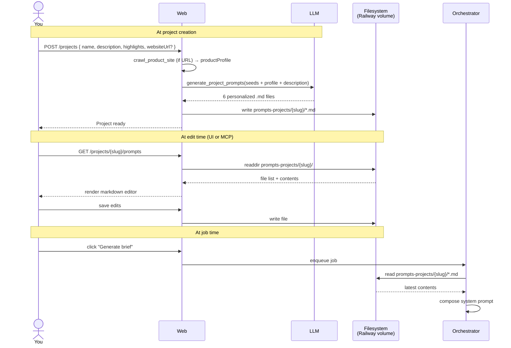

# 07 — Per-Project Prompts

**Purpose:** Explain why prompts live as editable `.md` files on disk (not as code constants), the directory layout, and how edits propagate.

---

## The idea

The orchestrator's behavior is shaped almost entirely by its prompts. If the prompts are baked into the code, every tweak — "less salesy," "more emojis," "shorter hooks" — needs a deploy.

So prompts live as `.md` files. There's a **seed template** set in `prompts/`, and a per-project set in `prompts-projects/{slug}/`. When you create a project, an LLM pass personalizes the seed templates using your description + highlights + (optionally) a fresh crawl of your product's website. The result is six product-aware prompt files written into `prompts-projects/{slug}/`. You then edit those copies from the web UI (or via MCP / directly on disk) and the next job picks up the changes.

See [13-crawling-and-prompt-gen.md](13-crawling-and-prompt-gen.md) for the full crawl + generation pipeline.

```
repo/
├── prompts/                          ← defaults, version-controlled
│   ├── director-brief.md
│   ├── carousel-plan.md
│   ├── video-plan.md
│   ├── image-caption.md
│   ├── text-overlay-copy.md
│   └── video-prompt.md
│
└── prompts-projects/                 ← per-project, Railway volume
    ├── my-todo-app/
    │   ├── director-brief.md         ← edited copy
    │   ├── carousel-plan.md          ← default copy
    │   ├── video-plan.md             ← edited copy
    │   ├── image-caption.md
    │   ├── text-overlay-copy.md
    │   └── video-prompt.md
    └── my-other-product/
        └── ...
```

---

## The seven files

| File | Used by | Shapes |
|---|---|---|
| `director-brief.md` | `runBriefJob` | The top-level system prompt for brief generation. Voice, tone, structure, what to optimize for. |
| `carousel-plan.md` | `runBriefJob` (when proposing carousels) and `runItemJob` (when generating them) | Slide structure, hook formulas, max slide count, when to use Canva vs text-overlay style. |
| `video-plan.md` | `runBriefJob` (proposing reels) and `runItemJob` (generating them) | 6-12s reel construction: hook in first second, payoff by second 5, audio-mode selection logic. |
| `image-caption.md` | Image / carousel finalize step | Caption style, CTA placement, hashtag rules per platform. |
| `text-overlay-copy.md` | `runItemJob` (text-on-image) | Short-form text rules: max chars, font picks, color/contrast guidance. |
| `video-prompt.md` | `runItemJob` (reels) — feeds Seedance | How to write Seedance prompts: camera moves, lighting, pacing, what Seedance does well/poorly. |
| `theme-story.md` | All visual jobs (carousels + reels) | Setting, mood, palette, motifs, narrative arc. Concatenated into every visual system prompt. See [15-theme-story.md](15-theme-story.md). |

Each file is plain markdown. The orchestrator concatenates the relevant files into the system message for each job — see [02-orchestrator.md](02-orchestrator.md).

### Seeds vs personalized

The same six filenames live in two places:

- `prompts/*.md` — **seed templates**. Generic; contain `## TO PERSONALIZE` blocks that tell the generator what to fill in (product voice, features, audience) and `## Always include` blocks that survive personalization. Version-controlled.
- `prompts-projects/{slug}/*.md` — **personalized for this project**. Generated on project creation by `generate_project_prompts`. Live on the Railway volume. Editable in the UI.

When you tweak a seed template (in `prompts/`), existing projects don't change — they keep their already-personalized copies. New projects pick up your edits. To roll a seed change forward into an existing project, use the "Regenerate prompts" button (with overwrite confirmation, since it clobbers your manual edits).

---

## Lifecycle



No caching at the orchestrator. Every job reads from disk fresh.

---

## The `packages/prompts-fs/` package

A tiny wrapper around `fs/promises` with two responsibilities:

1. **Path safety** — refuses to read or write outside `PROMPTS_DIR`. Filename allowlist of the six known files.
2. **Atomic writes** — write to `{file}.tmp`, then rename. So a concurrent read never sees a half-written file.

```ts
// packages/prompts-fs/index.ts (shape)
const ALLOWED_FILES = new Set([
  "director-brief.md", "carousel-plan.md", "video-plan.md",
  "image-caption.md", "text-overlay-copy.md", "video-prompt.md",
]);

export async function readProjectPrompt(slug: string, file: string): Promise<string> {
  if (!ALLOWED_FILES.has(file)) throw new Error(`disallowed file: ${file}`);
  return await fs.readFile(path.join(env.PROMPTS_DIR, slug, file), "utf8");
}

export async function writeProjectPrompt(slug: string, file: string, content: string): Promise<void> {
  if (!ALLOWED_FILES.has(file)) throw new Error(`disallowed file: ${file}`);
  const dir = path.join(env.PROMPTS_DIR, slug);
  await fs.mkdir(dir, { recursive: true });
  const tmp = path.join(dir, `${file}.tmp`);
  await fs.writeFile(tmp, content, "utf8");
  await fs.rename(tmp, path.join(dir, file));
}

export async function ensureProjectPrompts(slug: string): Promise<void> {
  // copy any missing defaults into prompts-projects/{slug}/
}
```

The `read_project_prompt` and `write_project_prompt` tools (exposed to MCP and the LLM) are thin wrappers around these.

---

## Editing from the UI

`/projects/{slug}/prompts` lists the six files and renders each in a `@uiw/react-md-editor`. Save → tRPC `prompt.write` → `packages/prompts-fs/writeProjectPrompt`.

There's no version history in v1. Files are overwritten in place. If you need history, the Railway volume is in git-tracked storage on most plans, or you can shell in and `cp` to a snapshot.

---

## Editing from Claude Code (via MCP)

```
> use shri.read_project_prompt with projectSlug "my-app" and file "video-prompt.md"
< (shows current content)

> use shri.write_project_prompt with projectSlug "my-app", file "video-prompt.md", content "..."
< OK

> (then via the web UI, click "Generate brief" again)
```

This is the workflow for iteratively tuning a prompt against real outputs.

---

## Why per-project (not global)?

Different products have different voices. A serious B2B SaaS shouldn't share prompts with a playful consumer mobile app. Per-project overrides let you fork the defaults once and diverge from there. You can always copy edits back to `prompts/` defaults if a pattern works for everything.

---

## See also
- [02-orchestrator.md](02-orchestrator.md) — how the orchestrator loads + composes the files
- [06-mcp-server.md](06-mcp-server.md) — using MCP to edit prompts from Claude Code
- [09-web-app.md](09-web-app.md) — the prompt editor route
