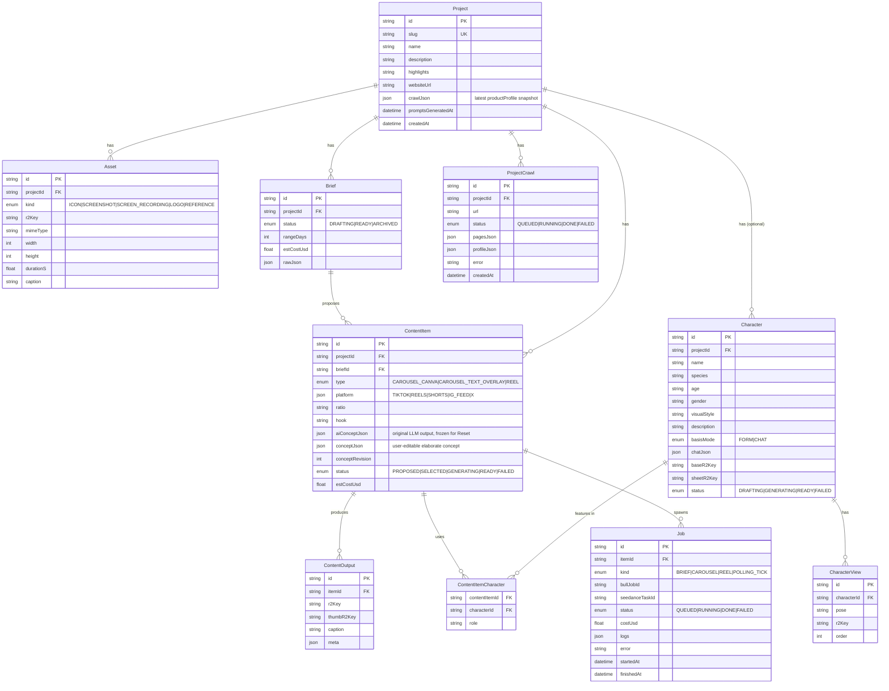

# 08 — Storage & Data Model

**Purpose:** Annotate the Prisma schema, document the R2 key layout, and explain why presigned URLs are central to making Seedance work.

---

## Prisma ERD



---

## Why these tables

- **`Project`** — one per product. Slug is used for R2 prefixing and the prompts directory name. `websiteUrl` + `crawlJson` cache the latest extracted product profile for the dashboard; `promptsGeneratedAt` tracks when the per-project prompts were last LLM-generated (used to detect manual edits before overwrite).
- **`ProjectCrawl`** — historical record of every crawl run for a project. Keeps both the raw pages and the LLM-extracted profile so you can diff over time.
- **`Asset`** — every uploaded file. Never deleted; we keep originals around indefinitely.
- **`Brief`** — one generation's output. Multiple briefs per project are fine (re-run later with edited prompts).
- **`ContentItem`** — a single proposed (then optionally selected) piece of content. The unit of work.
- **`ContentOutput`** — the final artifact(s) for an item. A carousel has one ContentOutput per slide; a reel has one ContentOutput for the final MP4.
- **`Job`** — the BullMQ-side tracking record. Logs accumulate in `logs` (JSONB) across polling ticks for Seedance.
- **`Character`** — optional. A reusable mascot/avatar/persona scoped to a project. Stores the canonical description, generation status, and pointers to the base reference image + the merged character sheet.
- **`CharacterView`** — a single pose for a character (front, side, back, expressions). Multiple views per character; their composite is the character sheet.
- **`ContentItemCharacter`** — join table letting a content item reference one or more characters with an optional role label.

`platform` is `Json` not `Platform[]` because Prisma's enum-array support in JSON columns is cleaner than native arrays on Postgres for this shape and we never query inside the array.

---

## R2 key layout

Every key is prefixed by `projects/{slug}/`. This lets you delete a project's entire blob storage with a single S3 list+delete pass.

```
projects/
└── {projectSlug}/
    ├── assets/
    │   ├── {uuid}.png                ← uploaded icon
    │   ├── {uuid}.png                ← uploaded screenshot
    │   └── {uuid}.mp4                ← uploaded screen recording
    ├── characters/
    │   └── {characterId}/
    │       ├── base.png              ← canonical reference, 1024x1024
    │       ├── sheet.jpg             ← merged labeled sheet
    │       └── views/
    │           ├── front.png
    │           ├── three-quarter.png
    │           ├── side.png
    │           ├── back.png
    │           ├── smile.png
    │           └── neutral.png
    ├── outputs/
    │   ├── {itemId}/
    │   │   ├── slide-0.png           ← carousel slides
    │   │   ├── slide-1.png
    │   │   ├── composite.png         ← text-on-image result
    │   │   ├── seedance.mp4          ← raw Seedance download
    │   │   ├── voice.mp3             ← TTS output (voiceover mode)
    │   │   └── final.mp4             ← muxed final
    │   └── ...
    └── thumbs/
        └── {itemId}/                 ← preview thumbnails for UI
```

The convention is enforced by helper functions in `packages/storage/keys.ts`:

```ts
export const keys = {
  asset:        (slug: string, id: string, ext: string) => `projects/${slug}/assets/${id}.${ext}`,
  outputSlide:  (slug: string, itemId: string, n: number) => `projects/${slug}/outputs/${itemId}/slide-${n}.png`,
  outputComposite: (slug: string, itemId: string) => `projects/${slug}/outputs/${itemId}/composite.png`,
  outputSeedance:  (slug: string, itemId: string) => `projects/${slug}/outputs/${itemId}/seedance.mp4`,
  outputVoice:  (slug: string, itemId: string) => `projects/${slug}/outputs/${itemId}/voice.mp3`,
  outputFinal:  (slug: string, itemId: string) => `projects/${slug}/outputs/${itemId}/final.mp4`,
  thumb:        (slug: string, itemId: string) => `projects/${slug}/thumbs/${itemId}.jpg`,
};
```

No tool builds keys ad hoc. The PM gate fails Phase B if any agent constructs R2 keys outside `keys`.

---

## Presigned URLs

Two flavors:

| | TTL | Used for |
|---|---|---|
| `signedReadUrl(key)` | 1 hour | Sent to Seedance as `image_url`. Also used in the UI to preview generated assets without proxying through Next.js. |
| `signedPutUrl(key, contentType)` | 5 minutes | Returned from tRPC to the browser for direct uploads, so files never transit the Next.js server. |

```ts
// packages/storage/r2.ts (shape)
export async function signedReadUrl(key: string, ttlSec = 3600) {
  return getSignedUrl(r2Client, new GetObjectCommand({ Bucket: env.R2_BUCKET, Key: key }), { expiresIn: ttlSec });
}

export async function signedPutUrl(key: string, contentType: string, ttlSec = 300) {
  return getSignedUrl(
    r2Client,
    new PutObjectCommand({ Bucket: env.R2_BUCKET, Key: key, ContentType: contentType }),
    { expiresIn: ttlSec }
  );
}
```

**Why presigned URLs matter for Seedance:** Seedance fetches the input image server-side. Our R2 bucket is private — no public access. Presigned URLs are the safe way to grant temporary read access for the duration of a Seedance job. We use 1-hour TTL because Seedance jobs can take 90s and we want margin.

---

## What we don't backup (yet)

R2 itself has 99.999999999% durability across multiple AZs — we trust that for now. Postgres is backed up by Railway's daily snapshots. There's no separate cold-storage tier for old projects; if you want to archive, `aws s3 sync` the prefix to local storage and `DELETE FROM Project WHERE id = ...` to free DB rows (CASCADE will drop everything else).

---

## See also
- [01-data-flow.md](01-data-flow.md) — when each row transitions states
- [04-seedance.md](04-seedance.md) — why image inputs go through R2 presigned URLs
- [11-deployment.md](11-deployment.md) — Railway volume + Postgres + Redis layout
