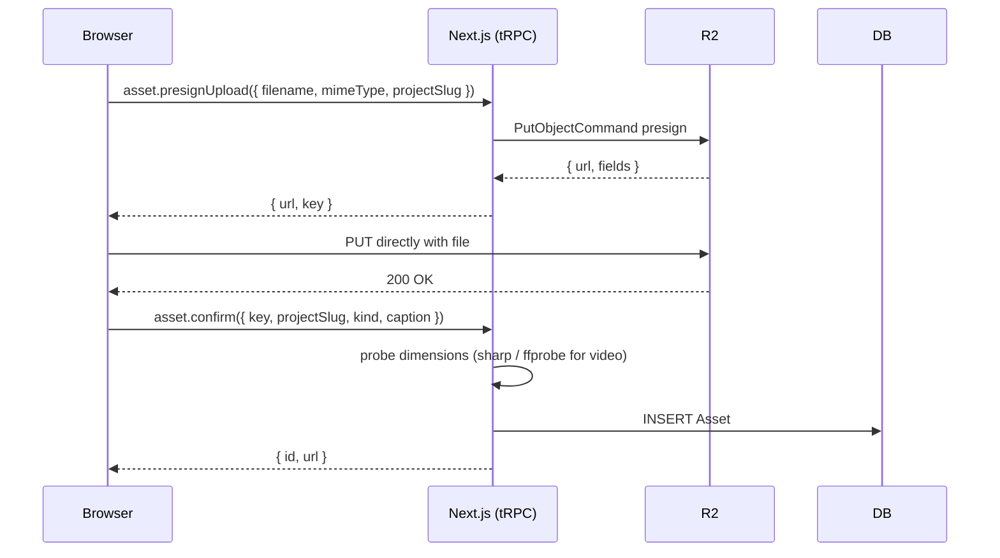

# 09 — Web App

**Purpose:** Map every route in `apps/web/`, document the tRPC API, and detail the selection-table page that's the centerpiece UI.

---

## Routes

| Path | Renders | tRPC procedures called |
|---|---|---|
| `/` | Project list, "+ New Project" button | `project.list` |
| `/projects/new` | Form: name, description, highlights, **product website URL (optional)** + asset dropzone (R2 direct upload). On submit, crawls site (if URL) and LLM-generates per-project prompts. | `project.create`, `project.crawl`, `project.generatePrompts`, `asset.presignUpload`, `asset.confirm` |
| `/projects/[slug]` | Project dashboard: latest brief link, item count, **Crawl & prompts panel**, **Characters panel** (list w/ thumbnails, "+ New character"), **Theme panel** (parsed mood/setting/palette + "Edit theme"), "Generate brief" button | `project.bySlug`, `project.latestCrawl`, `character.listForProject`, `prompt.themeSummary`, `brief.latestForProject`, `brief.start` |
| `/projects/[slug]/brief/[id]` | **The selection table** — every row expands to an editable elaborate concept (Seedance prompt + camera perspective + voiceover for reels; slide specs + embedded image prompts for carousels). See [16-editable-concepts.md](../docs/16-editable-concepts.md). | `brief.get`, `item.listByBrief`, `item.updateConcept`, `item.resetConcept`, `item.estimateCost`, `item.generateSelected` |
| `/projects/[slug]/items/[id]` | Item detail: previews, captions, download, characters used | `item.get`, `output.listByItem`, `character.listForItem` |
| `/projects/[slug]/prompts` | Markdown editor for the 7 `.md` files | `prompt.list`, `prompt.read`, `prompt.write` |
| `/projects/[slug]/theme` | Dedicated markdown editor for `theme-story.md` + sidebar help with the template | `prompt.read`, `prompt.write` |
| `/projects/[slug]/characters` | List of characters w/ thumbnails. "+ New character" button. | `character.listForProject` |
| `/projects/[slug]/characters/new` | Onboarding: form mode OR chat mode (toggle). On submit kicks off base + views + sheet generation. | `character.create`, `character.chat`, `character.generateSheet` |
| `/projects/[slug]/characters/[id]` | Character detail: large character sheet, editable attributes, regenerate buttons (base / views / sheet / individual poses), continue-chat (if chat-onboarded) | `character.get`, `character.update`, `character.regenerateBase`, `character.regenerateViews`, `character.regenerateSheet`, `character.regeneratePose`, `character.chat` |
| `/jobs` | Global job log, live status | `job.list`, `job.get` (polled) |

---

## The selection table (the centerpiece)

`/projects/[slug]/brief/[id]/page.tsx` — wireframe:

```
┌─────────────────────────────────────────────────────────────────────────────┐
│  My Todo App  ›  Brief #f3a2  (May 22, 2026)                                │
│                                                                             │
│  Director's summary:                                                        │
│  3 carousels + 4 reels for the next 7 days. Focus on the "drag to schedule" │
│  feature. Hooks are scroll-stopping, ranging from urgent ("Stop forgetting")│
│  to aspirational ("Your week, sorted in 30 seconds").                       │
│                                                                             │
│  Estimated total: $11.42                                                    │
│                                                                             │
│  ┌───┬─────────────┬─────────────┬───────┬───────────────────────────┬─────┐│
│  │ ✓ │ Type        │ Platform    │ Ratio │ Hook                      │ Cost││
│  ├───┼─────────────┼─────────────┼───────┼───────────────────────────┼─────┤│
│  │[✓]│ Reel        │ TikTok,Reel │ 9:16  │ "Stop forgetting things"  │$0.85││
│  │[✓]│ Reel        │ Shorts      │ 9:16  │ "30 seconds to plan..."   │$1.20││
│  │[ ]│ Reel        │ X           │ 16:9  │ "Your week, sorted"       │$1.20││
│  │[✓]│ Carousel    │ IG Feed     │ 4:5   │ "5 ways drag-to-sched..." │$0.36││
│  │[ ]│ Text-on-Img │ IG Feed     │ 1:1   │ "Before/after"            │$0.24││
│  │[✓]│ Carousel    │ TikTok      │ 9:16  │ "Day in the life with..." │$0.40││
│  │[ ]│ Reel        │ Reels       │ 9:16  │ "ASMR app demo"           │$0.85││
│  └───┴─────────────┴─────────────┴───────┴───────────────────────────┴─────┘│
│                                                                             │
│  4 selected · $2.81 estimated      [ Edit prompts ]   [ Generate selected ] │
└─────────────────────────────────────────────────────────────────────────────┘
```

Implementation notes:

- The table is a real HTML `<table>` for accessibility, styled with Tailwind + shadcn/ui.
- The "Hook" column is clickable → expands an inline drawer showing the full concept JSON (so you can see the scene breakdown / slide outlines without leaving the page).
- "Generate selected" disabled when zero rows selected; shows running total cost in the footer.
- After clicking, items transition `PROPOSED → SELECTED`, jobs are enqueued, the page auto-refreshes (or moves to `/jobs` to watch them).

---

## Asset upload flow



Direct browser → R2 PUT means we don't double-pay egress on a Railway proxy and don't blow through Next.js serverless body limits on big screen recordings.

`asset.confirm` does a server-side HEAD on the uploaded object to verify it actually exists, then probes dimensions with `sharp` (images) or `ffprobe` (video) before writing the DB row. If the HEAD 404s, the row is never created.

---

## Basic auth middleware

`apps/web/src/middleware.ts`:

```ts
export function middleware(req: NextRequest) {
  const auth = req.headers.get("authorization");
  const expected = "Basic " + btoa(`${env.BASIC_AUTH_USER}:${env.BASIC_AUTH_PASS}`);
  if (auth !== expected) {
    return new NextResponse("Auth required", {
      status: 401,
      headers: { "WWW-Authenticate": 'Basic realm="shri"' },
    });
  }
  return NextResponse.next();
}

export const config = { matcher: ["/((?!_next/static|_next/image|favicon).*)"] };
```

That's the entire auth story. Single user, browser-cached creds, good enough.

---

## tRPC routers

| Router | Procedures |
|---|---|
| `project` | `list`, `bySlug`, `create`, `delete`, `crawl`, `generatePrompts`, `latestCrawl` |
| `character` | `listForProject`, `listForItem`, `get`, `create`, `update`, `chat`, `generateSheet`, `regenerateBase`, `regenerateViews`, `regenerateSheet`, `regeneratePose`, `delete` |
| `asset` | `presignUpload`, `confirm`, `listForProject`, `delete` |
| `brief` | `start` (enqueues BRIEF job), `get`, `latestForProject` |
| `item` | `listByBrief`, `get`, `updateConcept`, `resetConcept`, `estimateCost`, `generateSelected` (enqueues per-item jobs) |
| `output` | `listByItem`, `download` (returns signed read URL) |
| `prompt` | `list`, `read`, `write` |
| `job` | `list`, `get` (with logs), `retry` |

All under `apps/web/src/server/trpc/routers/`. Standard tRPC v11 + Zod input validation. Mutations that enqueue jobs return the `Job.id` so the client can navigate to `/jobs` and watch.

---

## Live job updates

`/jobs` polls `job.list` every 2s via TanStack Query. Clicking a job expands its `Job.logs` (the tool-by-tool execution log accumulated by the orchestrator — see [02-orchestrator.md](02-orchestrator.md)).

We considered WebSockets / SSE but polling is fine for single-user scale and simpler to deploy on Railway. If you ever need many concurrent watchers, swap in `@trpc/server`'s subscription support over SSE.

---

## See also
- [01-data-flow.md](01-data-flow.md) — what happens after "Generate selected"
- [08-storage-and-data.md](08-storage-and-data.md) — the Prisma schema the routers query
- [11-deployment.md](11-deployment.md) — how the web app fits on Railway
