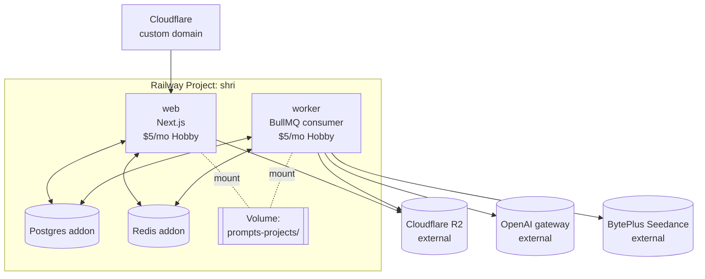

# 11 — Deployment (Railway)

**Purpose:** Lay out the Railway services, addons, volumes, and env wiring so this can ship.

---

## Services



Two long-running services (`web` and `worker`), two Railway-managed addons (Postgres, Redis), one shared volume (for `prompts-projects/`).

The MCP server (`apps/mcp`) is **not** deployed to Railway. It's an stdio server you run locally to drive the studio from Claude Code.

---

## `railway.toml` (root)

```toml
# Each service has its own /apps/{name}/railway.toml; this root file lists them.
[[services]]
name = "web"
source = "apps/web"

[[services]]
name = "worker"
source = "apps/worker"
```

Per-service files configure build + start:

```toml
# apps/web/railway.toml
[build]
builder = "nixpacks"
buildCommand = "pnpm install --frozen-lockfile && pnpm --filter @shri/web build"

[deploy]
startCommand = "pnpm --filter @shri/web start"
healthcheckPath = "/api/health"
restartPolicyType = "always"
```

```toml
# apps/worker/railway.toml
[build]
builder = "nixpacks"
buildCommand = "pnpm install --frozen-lockfile && pnpm --filter @shri/worker build"

[deploy]
startCommand = "pnpm --filter @shri/worker start"
restartPolicyType = "always"
```

---

## Addons

| Addon | Plan | Purpose |
|---|---|---|
| Postgres | starter | DB. `DATABASE_URL` auto-injected. |
| Redis | starter | BullMQ. `REDIS_URL` auto-injected. |

That's it — no Redis cluster, no read replicas, no failover. Single-user scale.

---

## The volume

`prompts-projects/` must survive deploys (it has your tuned per-project prompts). Railway volumes:

```
Volume name:  shri-prompts
Mount path:   /app/prompts-projects
Size:         1 GB  (plenty for thousands of projects of small md files)
Attached to:  web AND worker
```

`PROMPTS_DIR=/app/prompts-projects` in both services' env.

If you ever migrate off Railway, this volume is the only stateful thing not in Postgres or R2 — back it up before tearing down.

---

## Env vars (per service)

Both `web` and `worker` need the **same** env. Easiest: define them once in Railway's "Project Variables" and let both services inherit.

```
OPENAI_API_KEY            (secret)
OPENAI_BASE_URL           https://api.openai.com/v1
OPENAI_CHAT_MODEL         gpt-4o
OPENAI_IMAGE_MODEL        gpt-image-1
OPENAI_TTS_MODEL          gpt-4o-mini-tts
OPENAI_TTS_VOICE          alloy

ARK_API_KEY               (secret)
ARK_BASE_URL              https://ark.ap-southeast.bytepluses.com
ARK_VIDEO_MODEL           dreamina-seedance-2-0-260128

R2_ACCOUNT_ID             (secret)
R2_ACCESS_KEY_ID          (secret)
R2_SECRET_ACCESS_KEY      (secret)
R2_BUCKET                 shri-assets
R2_PUBLIC_BASE_URL        https://assets.yourdomain.com

DATABASE_URL              (auto from Postgres addon)
REDIS_URL                 (auto from Redis addon)
PROMPTS_DIR               /app/prompts-projects

BASIC_AUTH_USER           (secret)
BASIC_AUTH_PASS           (secret)

NODE_ENV                  production
```

---

## R2 bucket setup

1. Create bucket `shri-assets` in Cloudflare R2.
2. Create API token with **read+write** scoped to that bucket.
3. (Optional but recommended) Create a custom domain for the bucket (e.g. `assets.yourdomain.com`). Configure CORS to allow PUT from your Railway domain so the browser can upload directly. Without a custom domain, R2 still works — presigned URLs use the default endpoint.

CORS policy (paste into R2 dashboard):

```json
[
  {
    "AllowedOrigins": ["https://shri.yourdomain.com"],
    "AllowedMethods": ["GET", "PUT", "HEAD"],
    "AllowedHeaders": ["*"],
    "MaxAgeSeconds": 3600
  }
]
```

---

## Custom domain

Optional. Railway gives you a `*.railway.app` subdomain by default. If you want `shri.yourdomain.com`:

1. Add CNAME in Cloudflare → Railway target.
2. Add custom domain in Railway service settings.
3. Update R2 CORS `AllowedOrigins` to include the new domain.
4. Update `BASIC_AUTH_USER` / `BASIC_AUTH_PASS` (basic auth credentials should be tighter once you're on a public hostname).

---

## First-deploy checklist

1. Push to GitHub.
2. Connect repo to Railway. Add `web` and `worker` services pointing at the same repo with their respective root dirs.
3. Add Postgres + Redis addons.
4. Add volume `shri-prompts` mounted at `/app/prompts-projects` on both services.
5. Paste all env vars from `.env.example` into Project Variables.
6. First deploy will fail because Prisma migrations haven't run. Open Railway shell on `web`, run `pnpm db:migrate deploy`. Re-deploy.
7. Hit `https://shri.yourdomain.com/` — basic auth prompt. Log in.
8. Create your first project. Watch the worker logs in Railway dashboard.

---

## Scaling notes

Single-user scale is far below where any of this strains:

- One worker can comfortably handle ~50 concurrent Seedance polls (the delayed re-enqueue pattern means workers aren't blocked while polling — see [02-orchestrator.md](02-orchestrator.md)).
- Postgres starter is 1GB — millions of `Job.logs` JSONB entries before you outgrow it.
- Redis BullMQ uses a few MB.
- R2 has no egress fees; storage is $0.015/GB/mo.

If you ever go multi-user / multi-tenant (out of scope for v1), the choke points are: (1) BullMQ worker count for parallel reels, (2) R2 cost as asset volume grows.

---

## See also
- [01-data-flow.md](01-data-flow.md) — the runtime shape that maps onto these services
- [08-storage-and-data.md](08-storage-and-data.md) — DB schema + R2 layout
- [12-extending.md](12-extending.md) — what to touch when adding new providers
