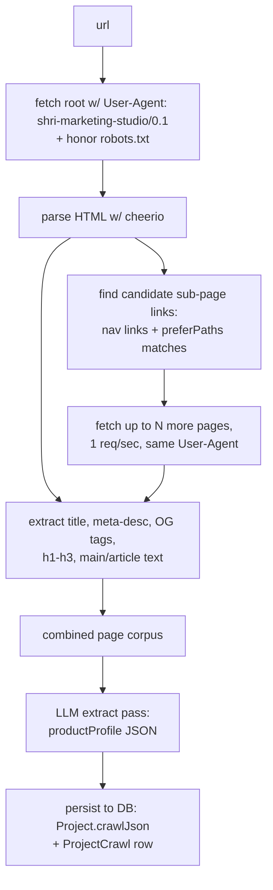
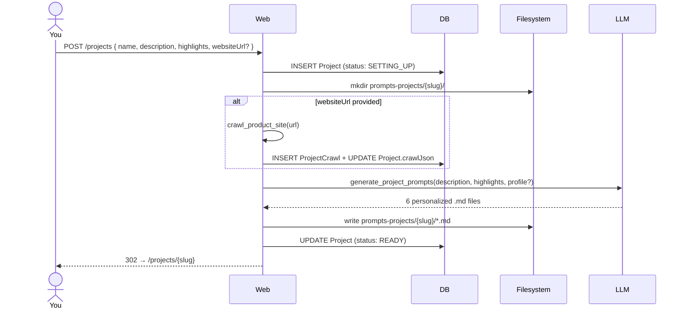

# 13 — Site Crawling & Prompt Generation

**Purpose:** Explain how a project's website is crawled to extract a product profile, and how that profile drives LLM-generated per-project prompts at creation time.

---

## The two new ideas

1. **Crawl the product's website** to ground the LLM in real, current information about what the product is, how it talks, what it does. The crawl produces a structured **product profile** stored on the project.

2. **Generate per-project prompts** by LLM-transforming the default prompt templates with the product profile baked in. The six default `.md` files in `prompts/` stop being copied verbatim into `prompts-projects/{slug}/`; instead they're treated as **seed templates** that the LLM rewrites with product-specific voice, features, and audience.

Both run automatically on `POST /projects` if a website URL is provided. Both are also exposed as MCP tools so you can re-run them ad hoc from Claude Code.

---

## The crawl

### Tool: `crawl_product_site`

```ts
input: {
  projectSlug: string;
  url: string;                       // root URL, e.g. "https://acme.app"
  maxPages?: number;                 // default 6 (root + 5 sub-pages)
  preferPaths?: string[];            // default ["/pricing", "/features", "/about", "/product", "/how-it-works"]
};

output: {
  pages: Array<{
    url: string;
    title: string;
    metaDescription: string | null;
    headings: string[];              // h1..h3 only
    bodyText: string;                // cleaned, ≤ 8000 chars per page
  }>;
  productProfile: {
    name: string | null;
    tagline: string | null;
    features: string[];              // up to 12
    valueProps: string[];            // up to 6
    targetAudience: string | null;
    tone: string;                    // free-text, e.g. "warm, playful, casual"
    inferredCategory: string | null; // e.g. "consumer task-management app"
  };
};
```

### How it works



### Implementation notes

- **No headless browser in v1.** Static HTML via `undici` + `cheerio`. Most marketing sites render content server-side or include enough in the initial HTML for OG tags / hero text. SPA sites get a degraded crawl that still captures `<title>` + meta description; the LLM extract step handles sparse input gracefully.
- **robots.txt** is fetched first and respected. If the site disallows our user-agent, the crawl fails politely and the project is created without auto-generated prompts.
- **Rate limit**: 1 concurrent request, 1-second delay between pages. We're not building a bot farm.
- **Page text limit**: 8000 chars per page after cleaning. Sites with monster homepages get truncated to the first H1 + first N paragraphs of `<main>`/`<article>` content.
- **No JS execution.** A site that's 100% client-side rendered will yield an empty crawl. We surface this to the user with a clear message in the UI ("No crawlable content found — fill in product description manually").

### What gets persisted

```prisma
model Project {
  // ... existing
  websiteUrl   String?
  crawlJson    Json?         // latest productProfile, for quick UI display
  crawls       ProjectCrawl[]
}

model ProjectCrawl {
  id          String   @id @default(cuid())
  projectId   String
  url         String
  status      CrawlStatus // QUEUED | RUNNING | DONE | FAILED
  pagesJson   Json        // full pages[] array (raw)
  profileJson Json        // productProfile
  error       String?
  createdAt   DateTime @default(now())
}
```

We keep historical crawls so you can re-crawl periodically (sites change) and diff what the LLM extracted across runs.

---

## Prompt generation

### Tool: `generate_project_prompts`

```ts
input: {
  projectSlug: string;
  basis: {
    description: string;        // user-provided
    highlights: string;         // user-provided
    productProfile?: ProductProfile;  // from a previous crawl, optional
    websiteUrl?: string;        // if set, we'll crawl on-demand when productProfile is absent
  };
  overwrite?: boolean;          // default false — refuse if files already edited
};

output: {
  files: {
    "director-brief.md":   string;
    "carousel-plan.md":    string;
    "video-plan.md":       string;
    "image-caption.md":    string;
    "text-overlay-copy.md": string;
    "video-prompt.md":     string;
  };
  written: boolean;             // whether files were actually persisted
};
```

### How it works

For each of the six prompt files:

1. Load the **seed template** from `prompts/{file}.md`. The seed is no longer a literal prompt — it's an instruction set with explicit `## TO PERSONALIZE` blocks.
2. LLM call: "Here is the seed template. Here is the product profile + user-provided description + highlights. Produce a personalized version of this prompt that incorporates voice, features, and audience specifics. Keep the same overall structure and sections."
3. Validate the output (must be markdown, must contain certain anchor headings).
4. Write to `prompts-projects/{slug}/{file}.md` via `packages/prompts-fs/`.

The six seed templates in `prompts/` ship with `## TO PERSONALIZE` callouts that tell the generator what to substitute or expand. For example, the seed of `director-brief.md` might say:

```markdown
You are the marketing director for a product.

## TO PERSONALIZE
- Replace this section with the product's name, what it does, and who it's for.
- Describe the voice in 2-3 sentences. (Default: "warm and direct.")
- List the 3-5 features most worth promoting, with one sentence of context each.

## Always include
- Always propose 2-3 reels, 1-2 Canva carousels, and 1 text-on-image post per brief
  unless the user explicitly overrides via prompt edits.
- Always estimate cost per item.
- Always include at least one hook that's a question.
...
```

After generation, the `## TO PERSONALIZE` blocks are replaced with concrete product-aware paragraphs; the `## Always include` sections survive unchanged.

### Overwrite protection

Once you've edited a prompt manually, re-running `generate_project_prompts` with `overwrite: false` (default) refuses to clobber it. We track this with file mtimes vs the last generation timestamp on `Project`. If you want a fresh regen, pass `overwrite: true` explicitly or use a UI button labeled "Regenerate prompts (will overwrite my edits)".

---

## The new project-creation flow



If the crawl fails (network, robots disallow, empty SPA), the prompts are still generated using only the user-provided description + highlights, and the project is marked READY with a banner in the UI: "Could not crawl your site — prompts were generated from your description alone. You can fill in details manually."

---

## From the web UI

`/projects/new` form gets a single new field:

```
[ Product website (optional)        ]
  https://...
  We'll crawl your homepage + key sub-pages to ground the LLM in real product info.
```

`/projects/{slug}` dashboard gains a "Crawl & prompts" section:

```
┌──────────────────────────────────────────────────────────────┐
│  Crawl & prompts                                             │
│                                                              │
│  Last crawled: 2026-05-22 14:30                              │
│  Pages: 5 · Features extracted: 8 · Tone: warm, playful      │
│  [ Re-crawl ] [ View extracted profile ] [ Regenerate prompts ] │
└──────────────────────────────────────────────────────────────┘
```

"View extracted profile" shows the JSON in a side drawer so you can sanity-check what the LLM pulled.

---

## From MCP

Both tools are first-class MCP tools, so from Claude Code you can:

```
> use shri.crawl_product_site with projectSlug "my-app" and url "https://my-app.com"
< (returns productProfile)

> use shri.generate_project_prompts with projectSlug "my-app", basis { description: "...", highlights: "...", productProfile: <paste-from-above> }
< (writes the 6 files, returns them)

> use shri.read_project_prompt with projectSlug "my-app" and file "video-prompt.md"
< (inspect the generated prompt)
```

This is the workflow for iteratively refining the seed templates: crawl, generate, inspect, edit the seed in `prompts/`, regenerate, compare.

---

## Why two separate tools (not one)

- Crawls are I/O-heavy and slow (~5-15s for 6 pages). Prompt generation is LLM-heavy but doesn't need a fresh crawl every time.
- You'll often want to re-crawl on a schedule without touching prompts (site changed, profile drifted).
- You'll often want to tweak `prompts/*.md` seed templates and regenerate without re-crawling (cheap iteration on the template language).
- Both being independent tools means the LLM in the orchestrator can also call them at runtime if it decides the current product profile is stale (e.g. "the product was renamed — let me re-crawl").

---

## See also
- [03-tools.md](03-tools.md) — `crawl_product_site` + `generate_project_prompts` descriptor schemas
- [07-prompts.md](07-prompts.md) — the seed-template format and `## TO PERSONALIZE` anchors
- [08-storage-and-data.md](08-storage-and-data.md) — `Project.websiteUrl`, `Project.crawlJson`, `ProjectCrawl` schema
- [09-web-app.md](09-web-app.md) — `/projects/new` website URL field + dashboard "Crawl & prompts" section
