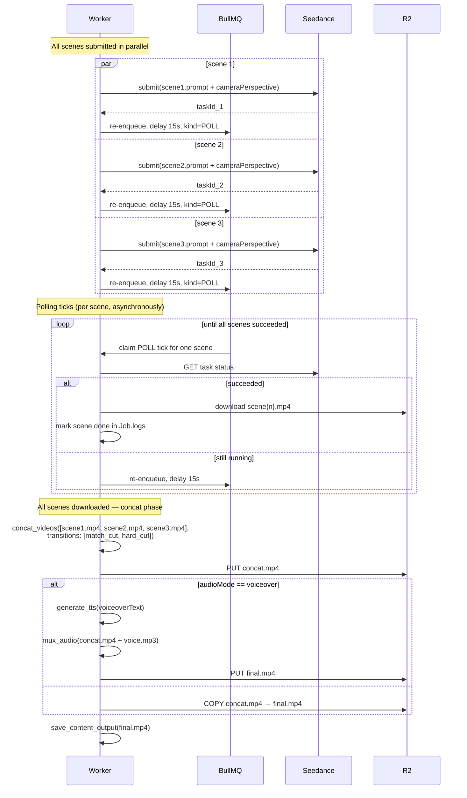

# 17 — Director's Scenes & Multi-Scene Reels

**Purpose:** Document the director's-perspective scene model — environment, surroundings, scene type — and the optional multi-scene reel path where several Seedance clips are stitched into one continuous video.

---

## The shift in framing

[16-editable-concepts.md](16-editable-concepts.md) introduced the elaborate concept: a Seedance prompt + camera perspective that the user can edit. Here we push it further. A scene is now described from a **director's perspective**: what's in frame, what's behind it, what surrounds it, and what kind of scene it is (dramatic, comedic, ambient, etc.). This matters most when more than one scene is produced for the same reel — the scenes need a shared world, or the result looks like a slideshow of unrelated clips.

**Single-scene reels remain the default.** Multi-scene is opt-in. Both flow through the same data shape so there's only one code path.

---

## The director's vocabulary

Every reel concept has an `environment` block describing the world the scene(s) live in, plus a scene-level type and prompt that's aware of that environment.

```ts
type SceneType =
  | "dramatic"      // tense, charged, slower pacing, low key light
  | "comedic"       // bright, snappy, looser camera
  | "ambient"       // observational, lifestyle, no narrative beat
  | "suspenseful"   // building tension, restrained reveals
  | "energetic"     // fast cuts, kinetic movement, high contrast
  | "intimate"      // close, soft, character-focused
  | "epic"          // wide framing, grand scale, sweeping moves
  | "documentary"   // handheld, naturalistic, candid;
```

```ts
type Environment = {
  setting:      string;   // e.g. "warm domestic interior, late afternoon"
  background:   string;   // what's visually behind the action; e.g. "wooden desk against a window with sheer linen curtains"
  surroundings: string;   // foreground props + texture; e.g. "sticky notes, coffee mug, laptop, scattered pens"
  timeOfDay:    "dawn" | "morning" | "midday" | "afternoon" | "golden_hour" | "dusk" | "night";
  weather?:     string;   // freeform: "soft overcast", "snow falling outside"
  mood:         string;   // 2-3 adjectives: "calm, slightly melancholic, hopeful"
  paletteHint?: string;   // overrides/complements theme palette
};
```

The environment is the **director's set description.** It's written once per reel and shared across every scene in that reel.

---

## The new REEL concept shape

```ts
type ReelConcept = {
  hook: string;
  durationS: number;                  // sum of scenes[].durationS
  audioMode: "seedance" | "silent" | "voiceover";
  voiceoverText?: string;
  characterIds?: string[];
  caption: string;

  // Top-level director context
  sceneType: SceneType;               // overall flavor
  environment: Environment;           // shared by all scenes

  scenes: Array<{                     // length 1 = single-scene; length ≥ 2 = multi-scene
    order: number;
    durationS: number;                // 3-12s per scene
    sceneType?: SceneType;            // can override top-level for this beat
    seedanceScript: {
      prompt: string;                 // describes THIS scene; references shared environment
      cameraPerspective: { framing, angle, movement, lens, focus };
    };
    characterViewR2Key?: string;      // i2v anchor for this scene
    transitionToNext?: "hard_cut" | "dissolve" | "match_cut" | "whip_pan" | "fade_to_black";
    notes?: string;
  }>;

  notes?: string;
};
```

`scenes.length === 1` is the common case — a single Seedance call, no stitching. `scenes.length ≥ 2` is the opt-in multi-scene flow.

---

## When to opt into multi-scene

The brief LLM only proposes a multi-scene reel when **the content genuinely benefits from it**. Heuristics baked into `prompts/video-plan.md`:

- A before/after structure ("messy desk → tidy desk") — two scenes minimum
- A 3-beat arc (setup → conflict → payoff) — three scenes
- A montage of repeated motions across contexts (different rooms, different times of day)
- A character entering, doing, exiting — three scenes if pacing matters

Single-scene is the default for everything else:

- Single-action loops
- Vibe shots / lifestyle b-roll
- Hook-payoff-CTA that fits in 8 seconds of one shot

The LLM is told to default to single-scene unless the hook is clearly multi-beat. Users can promote a single-scene to multi-scene in the edit drawer ("+ Add scene") or demote by deleting all but one scene.

---

## How a scene prompt reads

A single-scene prompt looks like a shot list. A multi-scene prompt references the established environment so the LLM (and Seedance) knows scene-to-scene continuity. Example from a 3-scene reel:

```yaml
sceneType: dramatic
environment:
  setting: "warm domestic interior, late afternoon"
  background: "wooden desk against a window with sheer linen curtains"
  surroundings: "sticky notes piled around a closed laptop, half-empty coffee mug, scattered pens"
  timeOfDay: golden_hour
  mood: "tired, overwhelmed → relieved, focused"
  paletteHint: "warm earth + soft cream + a sliver of late-sun gold"

scenes:
  - order: 1
    durationS: 3
    sceneType: dramatic
    seedanceScript:
      prompt: |
        Scene 1 of 3. SAME ENVIRONMENT THROUGHOUT THE REEL: a wooden desk by a window with sheer
        linen curtains, late afternoon golden light. Foreground: sticky notes piled around a
        closed laptop, half-empty mug, pens. Mood: tired, overwhelmed.
        ACTION: tight on a hand pinching a sticky note off the laptop, the camera slowly pushes
        in as more sticky notes are revealed peeling away beneath it.
      cameraPerspective:
        framing: close_up
        angle: high
        movement: dolly_in
        lens: macro
        focus: shallow_dof
    transitionToNext: match_cut

  - order: 2
    durationS: 3
    sceneType: dramatic
    seedanceScript:
      prompt: |
        Scene 2 of 3. SAME DESK, SAME WINDOW, SAME LIGHT. Continuity from scene 1: the sticky notes
        are gone, the desk is bare. ACTION: a young woman's hands enter frame and open the laptop;
        her face comes into focus behind it, lit by the screen and the warm window light.
      cameraPerspective:
        framing: medium
        angle: eye_level
        movement: static
        lens: normal
        focus: shallow_dof
    transitionToNext: hard_cut

  - order: 3
    durationS: 4
    sceneType: dramatic
    seedanceScript:
      prompt: |
        Scene 3 of 3. SAME DESK, SAME LIGHT. Continuity: laptop is open, the woman is focused on
        the screen. ACTION: pull back to a wider shot — her shoulders relax, she smiles slightly,
        the camera glides past her shoulder to reveal a clean, organized task list on the screen.
        END FRAME holds for the last second.
      cameraPerspective:
        framing: wide
        angle: eye_level
        movement: dolly_out
        lens: normal
        focus: deep_dof
```

Every scene prompt starts with an environment recap (`SAME DESK, SAME WINDOW, SAME LIGHT`). That redundancy isn't wasted — Seedance generates each scene independently with no memory of the previous one, so the only way to get continuity is to repeat the world description in every prompt.

The brief LLM is told to do this verbatim. The edit UI shows the environment block once at the top and the scenes below; you edit the environment once and a "Sync to scene prompts" button re-injects it into every scene's prompt with the right scene-number suffix.

---

## Multi-scene generation pipeline

When `scenes.length === 1`, the pipeline is identical to what [16-editable-concepts.md](16-editable-concepts.md) described.

When `scenes.length ≥ 2`:



Three things make this work:

1. **All Seedance submits fire in parallel.** A 3-scene reel doesn't take 3× the wall-clock time of a single-scene reel — it takes max(scene_durations).
2. **Polling per scene is independent** and uses the same delayed-re-enqueue pattern (each scene is its own polling state machine on top of the parent Job).
3. **Concatenation happens only after all scenes are downloaded.** The worker tracks scene status in `Job.logs` and only fires `concat_videos` when every scene is `DONE`.

If any scene fails terminally, the whole reel job fails. We don't try to ship 2 of 3 scenes — the user is asked to retry the failed scene or regenerate the whole reel.

---

## The new tool: `concat_videos`

```ts
input: {
  projectSlug: string;
  itemId: string;
  videoR2Keys: string[];                 // in order
  transitions?: Array<"hard_cut" | "dissolve" | "fade_to_black" | "whip_pan" | "match_cut">;
                                          // transitions[i] applies between videoR2Keys[i] and videoR2Keys[i+1]
};
output: {
  r2Key: string;                          // concat.mp4
  durationS: number;
};
```

Implementation strategy depends on the transition:

- **`hard_cut` / `match_cut`** (the vast majority): ffmpeg `concat` demuxer, lossless if all inputs share codec/resolution/framerate. This is the fast path — no re-encode, finishes in seconds.

  ```bash
  ffmpeg -f concat -safe 0 -i list.txt -c copy out.mp4
  ```

- **`dissolve` / `fade_to_black` / `whip_pan`**: ffmpeg `filter_complex` with `xfade` for crossfades, requires re-encode. Slower (~5-15s per transition) but works.

  ```bash
  ffmpeg -i a.mp4 -i b.mp4 \
    -filter_complex "[0:v][1:v]xfade=transition=fade:duration=0.3:offset=2.7[v]" \
    -map "[v]" out.mp4
  ```

Seedance outputs are already same-codec / same-framerate, so the lossless concat path covers >90% of real usage.

---

## The director's perspective is enforced in the seed prompts

`prompts/director-brief.md` and `prompts/video-plan.md` together push the brief LLM toward thinking like a director:

- Establish environment first; never write a scene prompt without it.
- Choose `sceneType` for tone before describing action.
- Describe what the **camera sees**, what's **behind** the subject, and what **surrounds** them.
- Treat scenes as a unit: if proposing multi-scene, ensure continuity in every prompt.
- Default to single-scene; promote to multi-scene only when the content needs an arc.

The MCP `SERVER_INSTRUCTIONS` (see [06-mcp-server.md](06-mcp-server.md)) also includes the multi-scene awareness so when Claude Code drives the studio directly it follows the same convention.

---

## UI changes

The reel edit drawer ([16-editable-concepts.md](16-editable-concepts.md)) gains:

```
┌──────────────────────────────────────────────────────────────────┐
│  Edit reel: "Stop forgetting things"                             │
│                                                                  │
│  ▸ Hook, duration, audio mode (unchanged)                        │
│                                                                  │
│  ─── Director ───────────────────────────────────────────────    │
│  Scene type:  [ dramatic ▼ ]                                     │
│                                                                  │
│  Environment                                                     │
│  Setting:      [ warm domestic interior, late afternoon       ]  │
│  Background:   [ wooden desk against a window w/ sheer linen  ]  │
│  Surroundings: [ sticky notes, coffee mug, laptop, pens       ]  │
│  Time of day:  [ golden_hour ▼ ]      Mood: [ tired → relieved] │
│  Palette hint: [ warm earth + soft cream + late-sun gold      ]  │
│  [ Sync environment to all scene prompts ]                       │
│                                                                  │
│  ─── Scenes ─────────────────────────────────────────────────   │
│  Single-scene  [○]    Multi-scene  [●]    [ + Add scene ]       │
│                                                                  │
│  ▼ Scene 1  (3s · close_up · macro · dolly_in)  [edit] [delete] │
│  ▶ Scene 2  (3s · medium · normal · static)     [edit] [delete] │
│  ▶ Scene 3  (4s · wide · normal · dolly_out)    [edit] [delete] │
│                                                                  │
│  Transitions: [ match_cut ] [ hard_cut ]                         │
│                                                                  │
│  Estimated cost: $4.50  (3 scenes × ~$1.50)                      │
│  [ Reset to AI version ]      [ Cancel ] [ Save script ]         │
└──────────────────────────────────────────────────────────────────┘
```

The Single-scene / Multi-scene toggle at the top of the Scenes block is the single click that promotes or demotes. Promoting from single → multi copies the existing scene as scene 1 and creates a stub scene 2 the user can fill in.

---

## Cost model

`estimate_cost` (see [10-cost-and-pricing.md](10-cost-and-pricing.md)) updated:

```ts
case "REEL": {
  const totalSeconds = item.conceptJson.scenes
    .reduce((sum, s) => sum + s.durationS, 0);
  const seedance = PRICING.REEL_SEEDANCE_PER_SECOND * totalSeconds;

  const transitions = item.conceptJson.scenes.length - 1;
  const concatCost = transitions > 0
    ? PRICING.CONCAT_PER_TRANSITION * transitions    // negligible — local ffmpeg
    : 0;

  const voiceover = item.conceptJson.audioMode === "voiceover"
    ? PRICING.REEL_VOICEOVER_ADDON
    : 0;

  return seedance + concatCost + voiceover;
}
```

`CONCAT_PER_TRANSITION` is essentially zero (`$0.001`) — ffmpeg is local. The dominant cost is still `REEL_SEEDANCE_PER_SECOND × sum(durations)`. Multi-scene reels cost more because they're longer total, not because stitching is expensive.

---

## What this doesn't try to do

- **Audio per scene.** Seedance audio (mode A) covers each scene's own SFX; we don't try to mix or sync per-scene audio against a single voiceover track. If audioMode is `voiceover`, every scene is generated `generate_audio: false`, then one TTS track is muxed over the concatenated video.
- **Crossfading audio.** Hard cuts on the audio track when scenes change. If you need a music bed, use `silent` mode and layer it externally — that's already the v1 convention.
- **AI-driven shot continuity.** We rely on prompt repetition + character sheets. Seedance doesn't have a "memory" across submissions; each scene is its own generation. If continuity is critical (same outfit, exact same lighting), use i2v with a fixed character view as the anchor for each scene.

---

## See also
- [16-editable-concepts.md](16-editable-concepts.md) — the underlying editable-concept system this builds on
- [04-seedance.md](04-seedance.md) — Seedance contract and the `cameraPerspective` schema
- [02-orchestrator.md](02-orchestrator.md) — `runItemJob` orchestration of parallel Seedance + concat
- [06-mcp-server.md](06-mcp-server.md) — MCP server instructions that bake in director's perspective
- [10-cost-and-pricing.md](10-cost-and-pricing.md) — multi-scene cost recalculation
